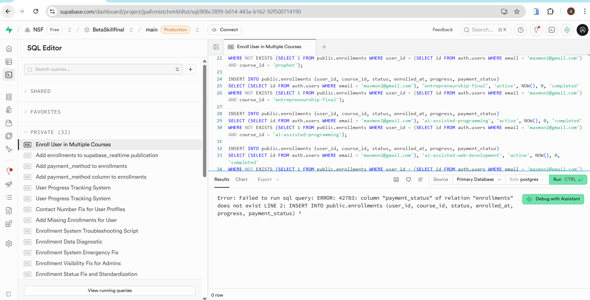

# 🚀 GRANT ACCESS TO maxmon2@gmail.com

## ⚡ Quick Action - Copy and Run This SQL

### Step 1: Open Supabase SQL Editor
Go to: https://supabase.com/dashboard/project/jpafcmixtchvtrkhltst/sql/new

### Step 2: Copy and Paste This Entire SQL Block


```

### Step 3: Click "RUN" Button

### Step 4: Verify (Optional)
Run this to confirm:
```sql
SELECT 
    u.email,
    COUNT(e.course_id) as total_courses
FROM public.enrollments e
JOIN auth.users u ON e.user_id = u.id
WHERE u.email = 'maxmon2@gmail.com'
GROUP BY u.email;
```

Should show: **22 courses**

---

## ✅ What This Does

- Grants access to ALL 22 courses (including new Prophet course)
- Sets status to 'active'
- Sets payment_status to 'completed'
- Course cards will automatically show **"Continue"** instead of "Enroll Now"

## 🔗 Direct Link
https://supabase.com/dashboard/project/jpafcmixtchvtrkhltst/sql/new

---

**Note:** The button text change is automatic. The CourseCard component checks enrollment status and shows "Continue" for enrolled users.
